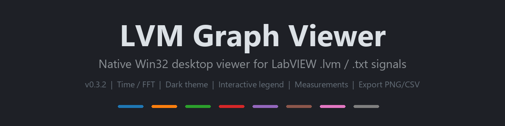

# LVM Graph Viewer



**[🇷🇺 Русский](README_RU.md)** | **[🇬🇧 English](README_EN.md)**

A dependency-free C++ desktop application for viewing LabVIEW `.lvm` / `.txt` signal files.

Two front ends share one parser/FFT library:

- **`lvm_viewer_gui.exe`** — a native Win32 desktop viewer (window, buttons, interactive plot). Latest version: **v0.5.1**.
- **`lvm_reader.exe`** — a command-line tool (structure, statistics, FFT peaks, CSV export).

The parser is a faithful C++ port of the Python LVM Signal Viewer, and the FFT matches numpy's `rfft` (to ~1e-13). Results match the Python reference on the bundled sample files (verified on a 1 GB / 6.8 M-sample file too).

## GUI Highlights (v0.5.1)

- **Monotonic timeline fix** — equal neighbouring timestamps are now pushed forward too, so `--monotonic` always produces a strictly increasing time axis.
- **FFT amplitude fix** — the Nyquist bin is no longer doubled, so edge-bin amplitudes are computed correctly.
- **Safer FFT decimation** — too-small `--fft-samples` values are rejected with a clear error instead of producing a degenerate transform.
- **CLI validation** — invalid values for `--channels`, `--head`, `--peaks`, `--fft-samples`, `--start`, and `--end` now report readable errors instead of terminating via uncaught exceptions.

Full documentation: [README_EN.md](README_EN.md) | [README_RU.md](README_RU.md)

## Quick Build

```bash
g++ -std=c++17 -O2 -municode -static -mwindows -o lvm_viewer_gui.exe \
    gui_main.cpp lvm_parser.cpp fft.cpp analysis.cpp \
    -lcomdlg32 -lgdi32 -luser32 -lgdiplus -lcomctl32
```

## CLI Quick Start

```bash
make
./lvm_reader.exe lvm_files_for_tests/test.lvm --info --stats --fft
```

See [README_EN.md](README_EN.md) or [README_RU.md](README_RU.md) for full details.
